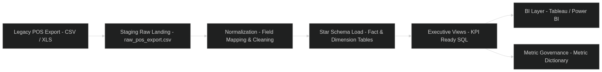

# BT-California — BI Architecture: Legacy POS → Executive Source of Truth (Case Study)

> **Note:** This repository uses a **synthetic dataset** modeled after real operational patterns to demonstrate methodology.  
> No proprietary data is included.

## Executive Summary
I designed a lightweight BI architecture to convert **unstructured legacy POS exports** into a governed reporting layer that supports executive decision-making.  
The result was a repeatable pipeline and KPI governance model that reduced manual reporting effort and enabled faster performance “deep dives.”

### Outcomes (from role experience)
- Reclaimed **~20+ hours/week** by replacing manual reporting with automated ingestion + standardized metrics
- Enabled real-time executive visibility through a single metric definition layer (“source of truth”)
- Established a scalable foundation for KPI cadence, drill-downs, and operational sprints

## Problem
Legacy POS systems produced exports that were:
- inconsistent across time/fields
- difficult to normalize for analytics
- heavily dependent on manual spreadsheet manipulation for weekly reporting

This created slow feedback loops and prevented reliable KPI governance.

## Approach (High Level)
1. **Ingest** legacy exports into a consistent staging format  
2. **Transform** into a star schema aligned to executive KPIs  
3. **Govern** metrics through a documented dictionary (single definitions + owners)  
4. **Publish** executive-ready views suitable for Tableau/Power BI

## Architecture Overview

This diagram illustrates the flow from legacy POS export → staging → dimensional model → governed executive KPI views → BI layer.

## Repository Map
- `docs/etl-architecture.md` — pipeline design + flow
- `docs/data-dictionary.md` — source fields → standardized definitions
- `docs/executive-source-of-truth.md` — governance model + KPI rules
- `governance/metric_dictionary.md` — metric definitions + owners + cadence
- `sql/00_schema.sql` — star schema tables (facts/dimensions)
- `sql/01_views.sql` — executive reporting views (KPI-ready)
- `data/` — synthetic legacy POS exports (demo)
- `analysis/` — example queries + KPI derivations
- `visuals/` — diagrams + dashboard mockups

## Data Model (Star Schema)
This repo models reporting around:
- **Fact tables:** sales, labor, promos (extensible)
- **Dimension tables:** date, location, product, employee/role (as needed)

See: `sql/00_schema.sql`

## Governance: Executive Source of Truth
This project emphasizes that dashboards are only as good as their definitions.
- Each KPI has an owner, formula, refresh cadence, and intended decision use.
- “One metric, one definition” enforced through the dictionary + views.

See: `governance/metric_dictionary.md` and `docs/executive-source-of-truth.md`

## How to Use This Repo (Browser-Friendly)
1. Review the architecture: `docs/etl-architecture.md`
2. Review metric governance: `governance/metric_dictionary.md`
3. Review schema + views: `sql/00_schema.sql`, `sql/01_views.sql`
4. Inspect synthetic exports: `data/`
5. Reference visuals/mockups: `visuals/`

## What I’d Improve Next
- Automate quality checks (schema validation, null thresholds, outlier flags)
- Add incremental refresh logic and audit logs
- Expand to forecasting (labor elasticity + product mix optimization)

---
**Author:** Wolfgang Welch  
**Focus:** BI Architecture • Program Delivery • Operational Analytics
